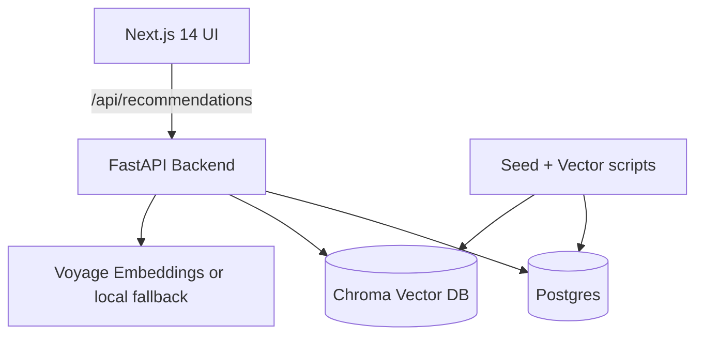

# phiademo

Social semantic product recommendations powered by friends’ purchase history, Voyage embeddings, and Chroma vector search.

## Why this exists
Shopping feels overwhelming. phiademo blends **social proof** (what your friends bought or viewed) with **semantic search** (what you actually mean) so recommendations feel intuitive and explainable.

## What it does
- **Single-page demo experience** with a search bar, filters, and an explanation-driven feed.
- **Semantic retrieval** against friends’ purchases/views using Voyage embeddings + Chroma.
- **Explainability** with distance-based confidence, friend signals, and recency context.
- **Seeded data** with realistic friends, products, and event history.

## Architecture


## Ranking formula
When a query is present, similarity dominates:
```
score = 0.75 * similarity_norm
      + 0.08 * friend_strength
      + 0.07 * recency
      + 0.05 * event_weight
      + lexical_boost
```
When the query is empty, the feed prioritizes friend strength, recency, and purchase intent.

## Confidence scoring
Distance → confidence bucket:
- **High**: distance <= `CONFIDENCE_DISTANCE_HIGH`
- **Medium**: `CONFIDENCE_DISTANCE_HIGH` < distance <= `CONFIDENCE_DISTANCE_MED`
- **Low**: distance > `CONFIDENCE_DISTANCE_MED`

## Data model
- `users` — the current user
- `friends` — 20 seeded friends with strengths + avatars
- `products` — 200 seeded products with rich descriptions
- `friend_events` — purchases + views + timestamps
- Chroma stores vectorized friend events with metadata

## Local development
### 1) Prerequisites
- Docker + Docker Compose
- (Optional) Voyage API key for real embeddings

### 2) Environment variables
Copy `.env.example` to `.env` and optionally set `VOYAGE_API_KEY`.

```bash
./scripts/create_env.sh
```

Then open `.env` (in the repo root) and paste your key after `VOYAGE_API_KEY=`. Do not paste secrets into `.env.example`.

### 3) Run the app
```bash
docker compose up --build
```
- The app will run at `http://localhost:3000`
- The API runs at `http://localhost:8000`
- Chroma runs at `http://localhost:8001`
- Data + vectors are auto-seeded on startup

### 4) Useful scripts
```bash
# Seed relational data
python scripts/seed_data.py

# Rebuild Chroma vectors
python scripts/reset_vector_db.py
```

## API endpoints
- `GET /api/recommendations?q=...&limit=...&category=...`
- `GET /api/friends`
- `GET /api/debug/vector?q=...`
- `POST /api/ingest`

## Vector search flow
1. Embed the query via Voyage (or deterministic fallback).
2. Query Chroma for top-K friend events.
3. Group matches by product, apply social weights and lexical boost.
4. Convert distance to confidence bucket and return explainability details.

If `VOYAGE_API_KEY` is missing, the app still runs using deterministic local embeddings so semantic search continues to work without secrets.

## Demo queries to try
- `serum` → Eden Skin Serum
- `lamp` → Lumen Smart Desk Lamp
- `headphones` → Nimbus Noise-Canceling Headphones

## Tradeoffs
- Uses a single-node Postgres + Chroma for simplicity.
- Heuristic ranking; not an ML pipeline.

## Future work
- User-specific personalization
- Real-time ingestion
- Experiment manager for weights + confidence thresholds

## Demo flow script
See `scripts/demo.md` for a guided demo walkthrough.
