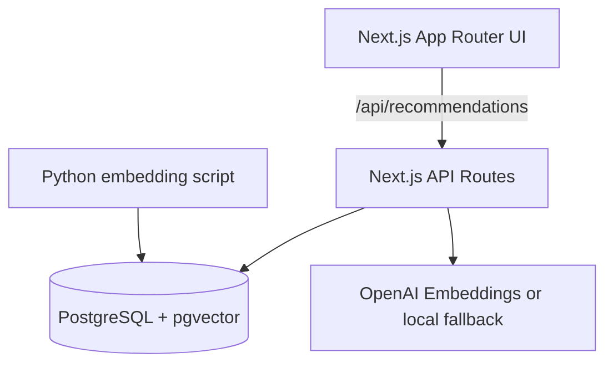

# phiademo

Social semantic product recommendations powered by friends’ purchase history and vector search.

## Why this exists
Modern shopping feels overwhelming. phiademo makes discovery feel human again by blending **social proof** (what your friends bought or viewed) with **semantic search** (what you actually mean). The result is a fast, elegant demo that tells you *why* each recommendation shows up.

## What it does
- **Single-page demo experience** with a search bar, curated feed, and “Why this?” explanations.
- **Semantic search** against your friends’ purchased/viewed items using pgvector.
- **Ranking model** that combines similarity, friend strength, recency, and event intent.
- **Fully seeded database** with realistic friends, products, and event history.

## Architecture


## Ranking formula
When a query is present, the score is:

```
score = 0.55 * similarity
      + 0.20 * friend_strength
      + 0.15 * recency
      + 0.10 * event_type_weight
```

When the query is empty, similarity is omitted and the feed prioritizes friend strength, recency, and intent.

## Product requirements covered
- Friend-driven feed when the query is empty.
- Semantic search with explanations when query is present.
- Modal reasoning with similarity, friend strength, recency, and matched keywords.
- Diversified results across categories and brands.

## Data model
- `users` — the current user
- `friends` — 20 seeded friends with strengths + avatars
- `products` — catalog with rich descriptions
- `friend_events` — purchases + views + timestamps
- `product_embeddings` — pgvector embeddings

## Local development
### 1) Prerequisites
- Docker + Docker Compose
- (Optional) OpenAI API key for real embeddings

### 2) Environment variables
Copy `.env.example` to `.env` and optionally set `OPENAI_API_KEY`.

```bash
./scripts/create_env.sh
```

Then open `.env` (in the repo root) and paste your key after `OPENAI_API_KEY=`. Do not paste secrets into `.env.example`.

### 3) Run the app
```bash
docker compose up --build
```
- The app will run at `http://localhost:3000`
- The API routes run inside Next.js
- Database is seeded and embeddings are generated automatically

### 4) Useful scripts
```bash
# Generate embeddings manually
python scripts/embed_products.py
```

## API endpoints
- `GET /api/recommendations?user_id=1&q=...&limit=...&category=...`
- `GET /api/friends`
- `GET /api/debug/stats`

## Embeddings fallback mode
If `OPENAI_API_KEY` is not set, the system uses a deterministic local embedding stub so the demo always works.

## Screenshots
> Add screenshots to this section after running the app.

## Tradeoffs
- Uses a single-node PostgreSQL for simplicity; horizontal scaling is not covered.
- Similarity and diversity are implemented with straightforward heuristics rather than full ML orchestration.

## Future work
- User profiles and personalized weights
- Real-time friend updates via websockets
- Feedback loop for ranking improvements
- A/B testing for explanation UX

## Demo flow script
See `scripts/demo.md` for a guided demo walkthrough.
